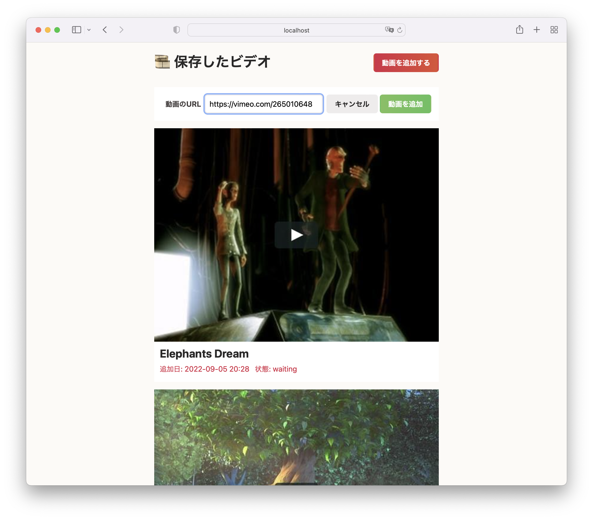

# YTDLOR



**YouTube-DL On Rail**

[youtube-dl](https://github.com/ytdl-org/youtube-dl)のフロントエンド

## デモサイト

準備中

## システム要件

- Ruby 3.1
- Redis

## セットアップ


## デバッグ

**必要なソフトウェアのインストール**

```sh
brew install youtube-dl
brew install redis
```

**gemsのインストール**

```sh
cd ytdlor
bundle
```

**Redisの起動**

```sh
brew services start redis
```

**ワーカーの起動**

```sh
./workers.sh
```

**Railsプロセスの起動**

```sh
rails s
```

起動したら http://localhost:3000/ でアクセスできる

**テストの実行**

```sh
rails test:system
```

テストのログを見るには、

```sh
tail -f log/test.log
```

**docker composeの動作確認**

```sh
RAILS_MASTER_KEY="$(cat config/credentials/production.key)" docker compose up
```

**solargraphのセットアップ**

```sh
yard
gem install solargraph-rails-init
solargraph-rails-init
```
